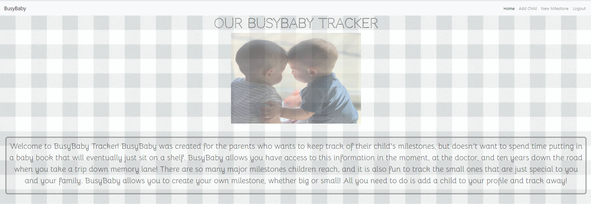
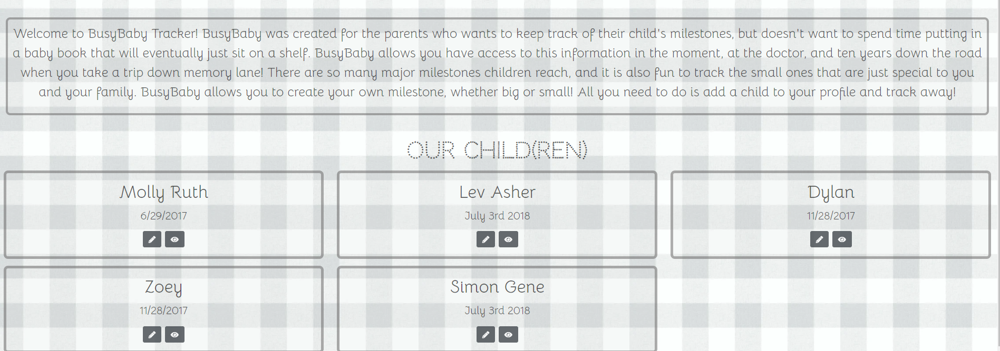
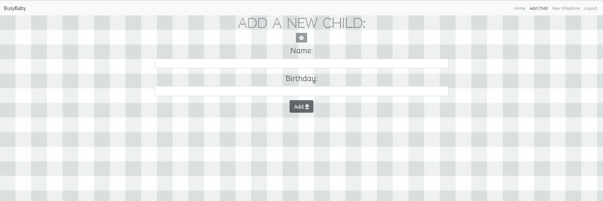
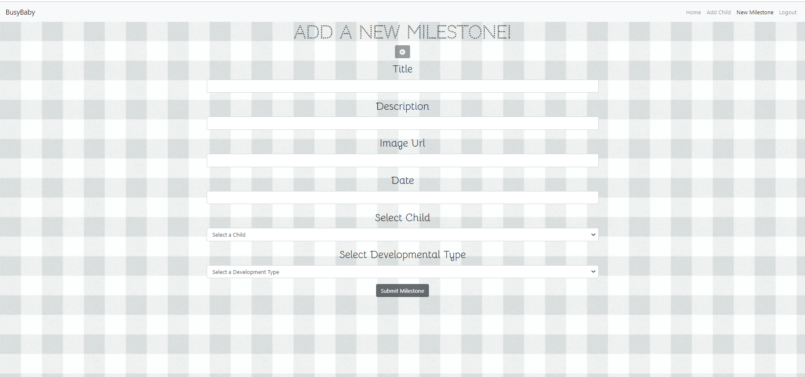
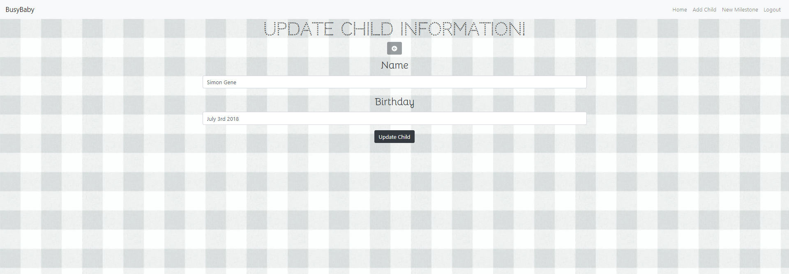
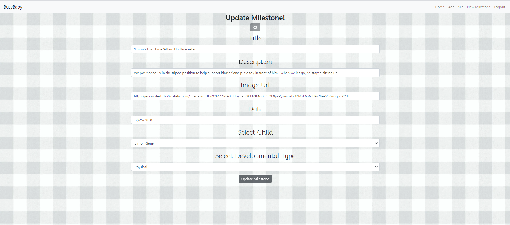

This project was bootstrapped with [Create React App](https://github.com/facebook/create-react-app).

## Description
This project is an application to provide a space for parents to “store” their children's milestones such as the first bath, first smile, first time sitting up, first time eating solid foods, etc.  When a parent logs in to the app, they will see their child(ren) on the home page.  From the homepage, they will be able to click on a button to see a single page view of that specific child's milestones.  They can also edit the information they entered about their child from the home page.  There are separate pages to add a child and add a milestone.  When they add another child, the child will be appear on their home page.  When they add a milestone, it will get added to the child's single view page.  For the milestone, they will be able to enter the title of the milestone, a description of what the milestone is, a picture of the children achieving the milestone, date the child achieved the milestone, and the type of milestone (such as a gross motor, social, cognitive, and communcation). They will also be able to edit the milestone or delete the milestone if they choose to do so.

## Screenshots
This is the main page of the application:

This is another view of the main page:

This is the add child page:

This is the new milestone page:

This is the edit child page:

This is the edit milestone page:

This is the single child view of milestones page:

## How To Run
1. Clone down this repo
1. Make sure you have  http-serve installed via npm. If not, get it [HERE](https://npmjs.com/package/http-server).
1. On your command line run `hs -p 9999`
1. In your browser go to `http://localhost:9999`
1. Or click on this link:
 https://busybaby-c7434.web.app
